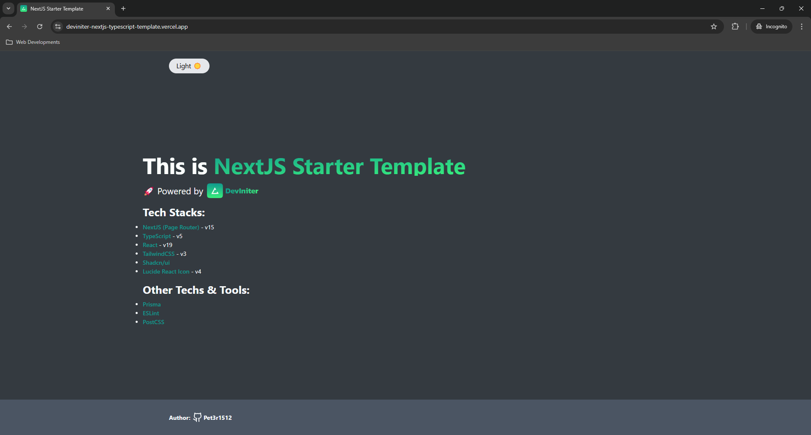
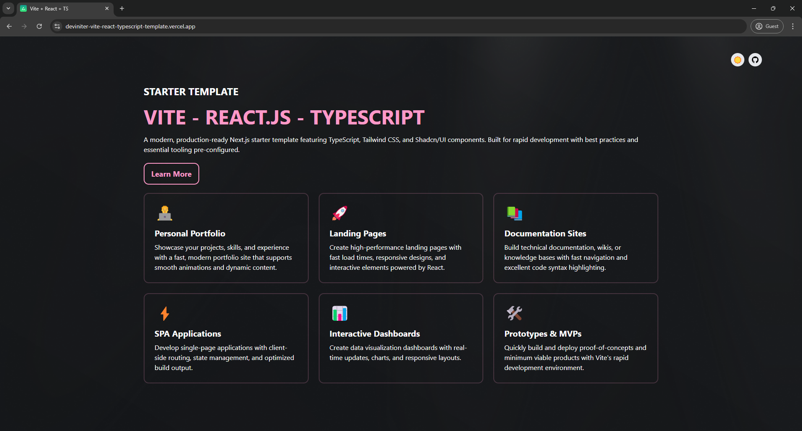

<a id="readme-top"></a>

<!-- PROJECT LOGO -->
<br />
<div align="center">
  <a href="https://github.com/Pet3r1512/DevIniter">
    
  </a>

<div align="center"> <a href="https://github.com/Pet3r1512/DevIniter_CLI/releases">
    
  </a> </div>

<h3 align="center"><strong>DevIniter</strong></h3>

  <p align="center">
    Initialize Developer's Projects with Pre-built Templates
    <br />
    <a href="https://deviniter.site/docs/introduction"><strong>Explore the docs »</strong></a>
    <br />
    <br />
    <a href="https://github.com/Pet3r1512/DevIniter/issues/new?labels=bug&template=bug-report---.md">Report Bug</a>
    ·
    <a href="https://github.com/Pet3r1512/DevIniter/issues/new?labels=enhancement&template=feature-request---.md">Request Feature</a>
  </p>
</div>

<!-- TABLE OF CONTENTS -->
<details>
  <summary>Table of Contents</summary>
  <ol>
    <li>
      <a href="#about-the-project">About DevIniter</a>
      <ul>
        <li><a href="#built-with">Built With</a></li>
      </ul>
    </li>
    <li><a href="#templates">Templates</a></li>
    <li>
      <a href="#getting-started">Getting Started</a>
      <ul>
        <li><a href="#prerequisites">Prerequisites</a></li>
        <li><a href="#installation">Installation</a></li>
      </ul>
    </li>
    <li><a href="#usage">Usage</a></li>
    <li><a href="#license">License</a></li>
    <li><a href="#contact">Contact</a></li>
  </ol>
</details>

## About DevIniter

[![Product Name Screen Shot][product-screenshot]](https://deviniter.site/)

<p align="right">(<a href="#readme-top">back to top</a>)</p>

### Built With

- [![Next][Next.js]][Next-url]
- [![React][React.js]][React-url]
- [![Tailwind][TailwindCSS]][Tailwind-url]

<p align="right">(<a href="#readme-top">back to top</a>)</p>

<!-- GETTING STARTED -->

## Templates

Until now, DevIniter provides 2 templates: Next.js - Page Router and Vite - React.js

###  Next.js - Page Router



###  Vite - React.js



<p align="right">(<a href="#readme-top">back to top</a>)</p>

## Getting Started

<strong>DevIniter</strong> provides a range of lightning-fast starter templates to help jumpstart your development journey.

### Prerequisites

Ensure you have the following tools installed on your system:

- Nodejs (v20.0.0 or higher)
- pnpm (v9.0.0 or higher)
- npm (v10.0.0 or higher)

<strong>Note</strong>: We are actively working to expand support for additional Node.js versions and package managers such as Yarn.

### Installation

Installing your favorite template by running:

```bash
  npx @deviniter/cli@latest
```

_For more examples, please refer to the [Documentation](https://www.deviniter.site/docs/introduction)_

<p align="right">(<a href="#readme-top">back to top</a>)</p>

## Usage

<strong>DevIniter</strong>'s templates are designed to streamline your development workflow. Each template comes pre-configured with modern development tools and best practices, allowing you to focus on building your application rather than setting up boilerplate code.

Our templates support various project types including:

- Full-stack web applications
- Static websites
- API services
- Personal Portfolios

<p align="right">(<a href="#readme-top">back to top</a>)</p>

<!-- CONTRIBUTING -->

## Contributing

Contributions are what make the open source community such an amazing place to learn, inspire, and create. Any contributions you make are **greatly appreciated**.

If you have a suggestion that would make this better, please fork the repo and create a pull request. You can also simply open an issue with the tag "enhancement".
Don't forget to give the project a star! Thanks again!

1. Fork the Project
2. Create your Feature Branch (`git checkout -b feature/AmazingFeature`)
3. Commit your Changes (`git commit -m 'Add some AmazingFeature'`)
4. Push to the Branch (`git push origin feature/AmazingFeature`)
5. Open a Pull Request

<p align="right">(<a href="#readme-top">back to top</a>)</p>

<!-- LICENSE -->

## License

Distributed under the MIT License. See [LICENSE](https://github.com/Pet3r1512/DevIniter/blob/master/LICENSE) for more information.

<p align="right">(<a href="#readme-top">back to top</a>)</p>

<!-- CONTACT -->

## Contact

Peter Pham - peter1512.dev@gmail.com - [X Profile](https://x.com/Thnh_Phng_) - [LinkedIn](https://www.linkedin.com/in/peter-pham-6b02a2229)

Project Link: [https://github.com/Pet3r1512/DevIniter](https://github.com/Pet3r1512/DevIniter)

<p align="right">(<a href="#readme-top">back to top</a>)</p>

<!-- MARKDOWN LINKS & IMAGES -->
<!-- https://www.markdownguide.org/basic-syntax/#reference-style-links -->

[contributors-shield]: https://img.shields.io/github/contributors/github_username/repo_name.svg?style=for-the-badge
[contributors-url]: https://github.com/github_username/repo_name/graphs/contributors
[forks-shield]: https://img.shields.io/github/forks/github_username/repo_name.svg?style=for-the-badge
[forks-url]: https://github.com/github_username/repo_name/network/members
[stars-shield]: https://img.shields.io/github/stars/github_username/repo_name.svg?style=for-the-badge
[stars-url]: https://github.com/github_username/repo_name/stargazers
[issues-shield]: https://img.shields.io/github/issues/github_username/repo_name.svg?style=for-the-badge
[issues-url]: https://github.com/github_username/repo_name/issues
[license-shield]: https://img.shields.io/github/license/github_username/repo_name.svg?style=for-the-badge
[license-url]: https://github.com/github_username/repo_name/blob/master/LICENSE.txt
[linkedin-shield]: https://img.shields.io/badge/-LinkedIn-black.svg?style=for-the-badge&logo=linkedin&colorB=555
[linkedin-url]: https://linkedin.com/in/linkedin_username
[product-screenshot]: public/images/screenshot/deviniter_screenshot.png
[Next.js]: https://img.shields.io/badge/next.js-000000?style=for-the-badge&logo=nextdotjs&logoColor=white
[Next-url]: https://nextjs.org/
[React.js]: https://img.shields.io/badge/React-20232A?style=for-the-badge&logo=react&logoColor=61DAFB
[React-url]: https://reactjs.org/
[TailwindCSS]: https://img.shields.io/badge/tailwindcss-%2338B2AC.svg?style=for-the-badge&logo=tailwind-css&logoColor=white
[Tailwind-url]: https://tailwindcss.com/
